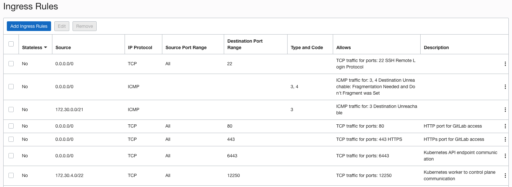
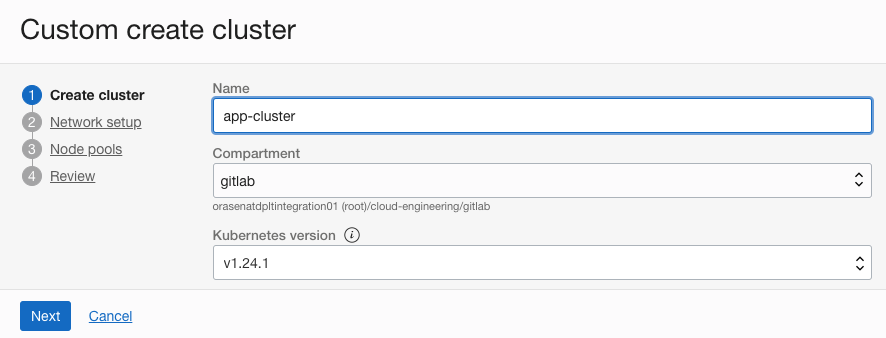
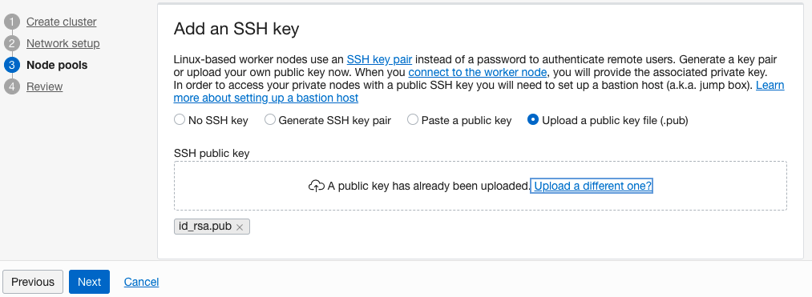
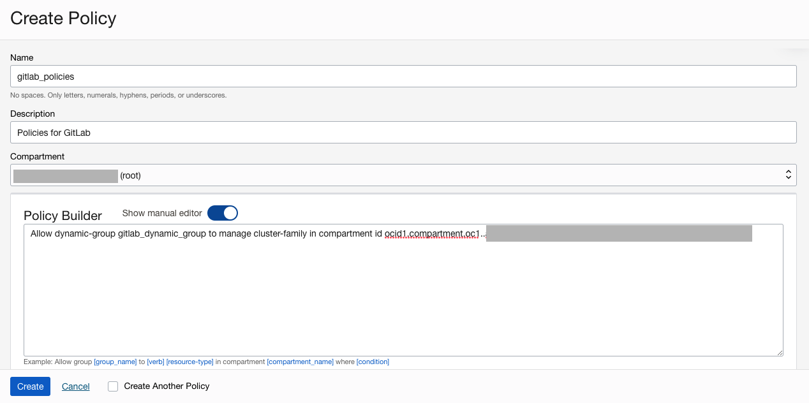

# Provision a Container Engine for Kubernetes (OKE)

## Introduction

This Lab will walk you through the step by step instructions of provisioning a Container Engine for Kubernetes (OKE). This Kubernetes cluster will be used to deploy a two-tier application that will be managed by GitLab CI/CD pipeline.

Estimated Time: 60 minutes

### Objectives

In this lab, you will:
* Security Rule Configuration in Security Lists 
* Provison a Kubernetes Cluster and a Node Pool
* Access Kubernetes Cluster
* Deploy a sample application on the Kubernetes cluster

### Prerequisites

This lab assumes you have:
* An Oracle Cloud account
* All previous labs successfully completed


<!-- *This is the "fold" - below items are collapsed by default* -->

## Task 1: Security Rule Configuration in Security Lists

The VCN in which you want to create and deploy clusters must have specific security rules defined. The worker nodes, Kubernetes API endpoint, pods (when using VCN-native pod networking), and load balancer have different security rule requirements, as configured in this lab. You can add additional rules to meet your specific needs.

1. Modify the Ingress rules in Security List of the *Public Subnet* as follows:

	

2. Modify the Ingress rules in Security List of the *Private Subnet* as follows:

  

3. The default Egress rules for both *Public and Private Subnets* should suffice. 

  

## Task 2: Create Managed Kubernetes (OKE) Cluster

1. Sub step 1 - tables sample


2. Sub step 2 - tables sample

3. Sub step 3 - tables sample

4. Sub step 4 - tables sample

5. Sub step 5 - tables sample

6. Sub step 6 - tables sample

7. Sub step 7 - tables sample


## Task 3: Install Kubectl Utility
1. Download the latest release with the command
  ```
  <copy>curl -LO "https://dl.k8s.io/release/$(curl -L -s https://dl.k8s.io/release/stable.txt)/bin/linux/amd64/kubectl"</copy>
  ```

2. Validate the binary (optional). Download the kubectl checksum file:
  ```
  <copy>curl -LO "https://dl.k8s.io/$(curl -L -s https://dl.k8s.io/release/stable.txt)/bin/linux/amd64/kubectl.sha256"</copy>
  ```

3. Validate the kubectl binary against the checksum file:
  ```
  <copy>echo "$(cat kubectl.sha256)  kubectl" | sha256sum --check</copy>
  ```
If valid, the output is:
  ```
  kubectl: OK
  ```
4. Get the Checksum from the Kubectl checksum file
  ```
  <copy>cat kubectl.sha256 ; echo</copy>
  e23cc7092218c95c22d8ee36fb9499194a36ac5b5349ca476886b7edc0203885
  ```

5. Get the checksum of the Kubect utility. download earlier
  ```
  <copy>sha256sum kubectl</copy>
  e23cc7092218c95c22d8ee36fb9499194a36ac5b5349ca476886b7edc0203885  kubectl
  ```
6. If the Checksum from the file and the Kubectl utility match, install the Kubect utility
  ```
  <copy>sudo install -o root -g root -m 0755 kubectl /usr/local/bin/kubectl</copy>
  # Enable kubectl autocompletion
  <copy>echo 'source <(kubectl completion bash)' >>~/.bash_profile</copy>
  <copy>source ~/.bash_profile</copy>
  ```

## Task 4: Create IAM Policies




## Task 5: Install OCI CLI on Linux 8
1. Install OCI Cli
  ```
  <copy>sudo dnf -y install oraclelinux-developer-release-el8</copy>
  <copy>sudo dnf -y install python36-oci-cli</copy>
  <copy>oci --version</copy>
  ```
2. Enable Instance Principal Authenication and reload the profile
  ```
  <copy>sudo echo 'export OCI_CLI_AUTH=instance_principal' >> ~/.bash_profile</copy>
  <copy>source ~/.bash_profile</copy>
  ```


4. Verifying the OCI CLI Installation
  ```
  <copy>oci os ns get</copy>
  {
    "data": "orasenatdpltintegration03"
  }
  ```


## Task 6: Access the OKE Cluster
1. To access the Kubernetes cluster access details click the **Navigation Menu** in the upper left, navigate to **Developer Services** , and select **Kubernetes Clusters (OKE)**. Click the cluster name created earlier and click on **Access Cluster**. This shows all the steps needed to be performed on a machine to access the OKE Cluster successfully. Since No Public IP was assigned to the Kubernetes API endpoint, therefore the cluster would only be accessible from any compute running inside the customer VCN.


2. Create a directory to contain the kubeconfig file
  ```
  <copy>mkdir -p $HOME/.kube</copy>
  ```

3. To access the kubeconfig for your cluster via the VCN-Native private endpoint, execute the command copied earlier (this should be different everyone):
  ```
  oci ce cluster create-kubeconfig --cluster-id ocid1.cluster.oc1.iad.aaaaaaaaptlwwc5cy4ngggtybswnpfpdbga5mnhpfajjxkxupcn5vxlanmka --file $HOME/.kube/config --region us-ashburn-1 --token-version 2.0.0  --kube-endpoint PRIVATE_ENDPOINT
  ```

4. Set your KUBECONFIG environment variable to the file for this cluster
  ```
  <copy>echo "export KUBECONFIG=$HOME/.kube/config" >>~/.bash_profile</copy>
  ```

5. Get the cluster details
  ```
  <copy>kubectl get nodes</copy> 
  NAME          STATUS   ROLES   AGE     VERSION
  172.30.2.25   Ready    node    6m43s   v1.24.1
  172.30.3.84   Ready    node    6m29s   v1.24.1 
  ```

## Task 7: Install Helm
1. Helm has an installer script that will automatically grab the latest version of Helm and install it locally. 
  ```
  <copy>curl -fsSL -o get_helm.sh https://raw.githubusercontent.com/helm/helm/main/scripts/get-helm-3</copy>
  <copy>chmod 700 get_helm.sh</copy>
  <copy>./get_helm.sh</copy>
  ```

## Task 8: Add GitLab Helm Respoitory
1. Add GitLab Repository to the compute instance
  ```
  helm repo add gitlab http://charts.gitlab.io/
  ```


## Learn More


* [Install Kubectl on Linux](https://kubernetes.io/docs/tasks/tools/install-kubectl-linux/)
* [Helm](https://helm.sh/docs/intro/install/)
* [URL text 2](http://docs.oracle.com)

## Acknowledgements
* **Author** - Farooq Nafey, Principal Cloud Architect
* **Last Updated By/Date** - August 2022
